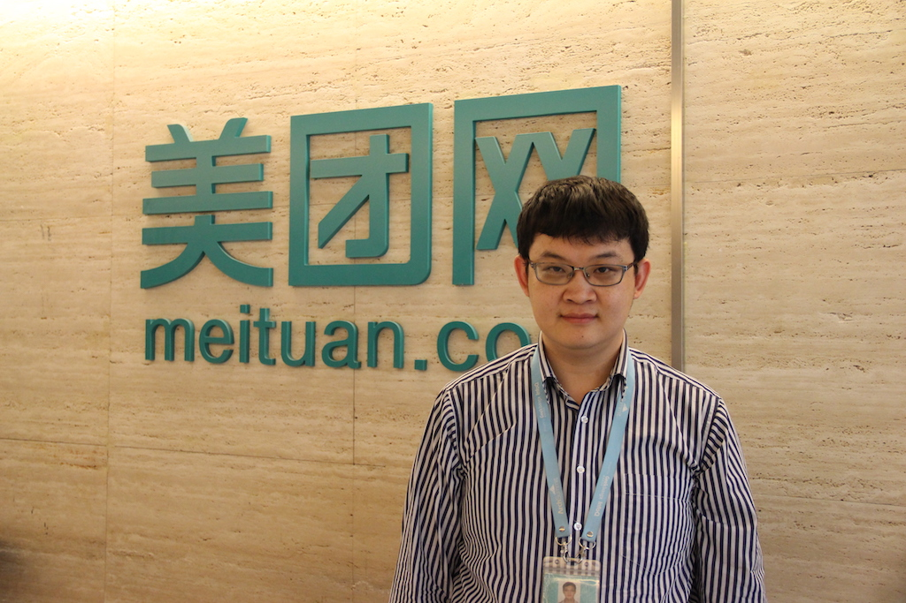
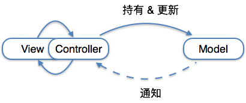
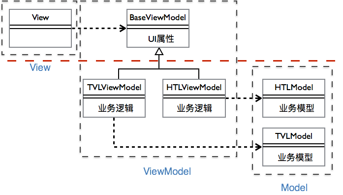
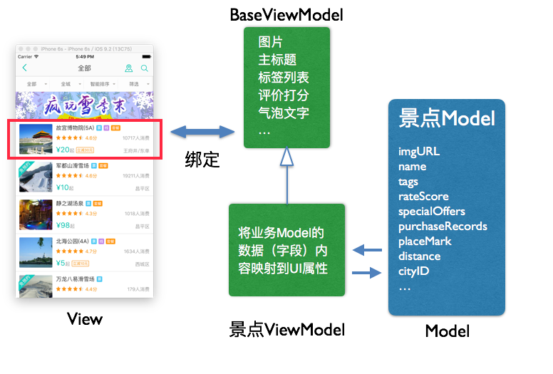
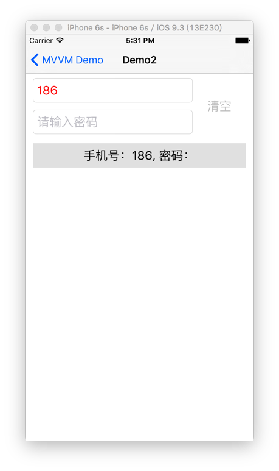

<!-- toc orderedList:0 -->

- [MVVM实战](#mvvm实战)
	- [讲师简介](#讲师简介)
	- [课程目的](#课程目的)
	- [MVVM基础知识](#mvvm基础知识)
		- [MVVM解决了什么问题？](#mvvm解决了什么问题)
		- [对比MVC与MVVM](#对比mvc与mvvm)
		- [MVVM实现代码复用](#mvvm实现代码复用)
	- [MVVM编程实战](#mvvm编程实战)
		- [Demo 1：单纯UI展示](#demo-1单纯ui展示)
		- [Demo 2：表单页面](#demo-2表单页面)
		- [其他细节](#其他细节)
			- [单元测试](#单元测试)
			- [页面跳转](#页面跳转)
	- [扩展阅读](#扩展阅读)

<!-- tocstop -->


# MVVM实战

## 讲师简介



**梁士兴**

- 2009年毕业于北京航空航天大学
- 2009~2014 就职于IBM CDL
- 2014年加入美团-大众点评，职位是iOS高级技术专家
- 翻译书籍《Swift编程实战 iOS应用开发实例及完整解决方案》
- 2016年3月在QCon上分享了《MVVM与FRP编程实战》主题演讲
- 有多年的iOS开发经验，长期关注iOS前沿技术


## 课程目的

本教程主要面对iOS研发从业人员，具备iOS开发基础知识，掌握一定的软件架构能力。

通过本教程，可以收获如下：

- 了解MVVM的原理、优势和不足
- 在典型的业务场景中使用MVVM模式
- 利用MVVM的优势，实现代码复用
- 使用MVVM进行单元测试

## MVVM基础知识

MVVM是一种软件建构模式<sup>1</sup>。最早由微软架构师Ken Cooper和Ted Peters开发。尽管微软大力推广的WPF和SilverLight并没有得到市场的充分认可，但MVVM架构的模式却非常有可取之处。

> 1\. 摘自维基百科：https://en.wikipedia.org/wiki/Model%E2%80%93view%E2%80%93viewmodel
>

美团是从2015年春天开始初步尝试了MVVM模式。初期考虑是看中了MVVM模式容易进行单元测试的特点，因为ViewModel本质是一个普通OC对象，对它进行测试可以脱离UI环境，也不需要复杂的mock开发。

然而理论就是理论，在美团的业务场景中，通常页面会随着版本迭代发生快速的变化。业务逻辑的频繁迭代意味着维护一套单元测试的用例的代码其实也是很重的包袱。事实上，除了一些核心页面的关键流程，我们**并没有**实现过很高比例的单测覆盖。那是不是说MVVM的实践是毫无价值的呢？当然不是，我们在实践MVVM模式的时候，发现这是一种非常容易进行代码复用的模式，后面会做详细阐述。

事实上，在我工作的团队中，更加渴望实现代码的复用。我们团队负责美团的酒店旅游相关的业务，虽然业务上并不相同，但存在大量的相似之处：比如，不管是酒店住宿还是旅游出行，通常都需要预约。因此，我们实施MVVM的重点，逐渐从单元测试转移到了代码复用上。

在iOS领域实践MVVM模式，通常需要使用RAC(ReactiveCocoa)去实施FRP(Functional Reactive Progamming<sup>2</sup>)。这是一个伪命题，本质上讲实现MVVM并不需要使用RAC，但脱离了RAC或与之类似的框架，再实现MVVM的代码将变得非常丑陋。为什么说是伪命题呢？因为ReactiveCocoa和FRP和传统的OOP（面向对象编程）思路并非一脉相承。熟练的掌握RAC和FRP有很高的学习曲线，如果在团队和项目中实践MVVM，需要对相关的技术优势和困难有比较清醒的认识。本教程就是希望通过一些简化的场景，帮助大家降低使用MVVM的门槛，真正让MVVM为项目和团队带来价值。

> 2\. https://en.wikipedia.org/wiki/Functional_reactive_programming
>

### MVVM解决了什么问题？

很多文章会说MVVM可以解决许多MVC中遇到的问题，比如ViewController代码太多，写得太重！本人完全不认同这一点。MVC写得太重是因为解耦没有做好，层次模块没有划分清楚。如果没有很好的解除耦合和划分清楚层次模块，ViewModel一样会变重。

使用MVVM，可以解决两个问题:

1. 实现**代码复用**。有利于开发业务无关UI组件
2. 实现UI组件级别的**单元测试**，而不需要复杂的Mock。

### 对比MVC与MVVM

首先参考MVC与MVVM的逻辑示意图：

> 
>
> 图1 MVC模式

- **View** — 显示用户界面
- **Model** — 实现业务逻辑
- **Controller** — 起到不同层面间的组织作用，用于控制应用程序的流程

> 
>
> 图2 MVVM模式

- **View** — 显示用户界面
- **Model** — 实现业务逻辑
- **ViewModel** — 通过一系列属性和命令，对视图进行抽象

从示意图来看，MVVM本质的区别在与，ViewModel是通过“绑定”方式与View进行交互。这会带来两点好处：

1. **代码复用** - ViewModel与View之间的耦合关系更加松散，从而可以实现View的复用。这里稍微卖个关子，后面做详细阐述。
2. **单元测试** - 由于“绑定”关系是通过三方框架建立的，绑定的结果是可信的。因此只需要测试到ViewModel一级，就可以覆盖业务逻辑在UI上的体现。又由于ViewModel本身都是普通Objective-C对象，不需要复杂的Mock就可以运行，所以更容易进行单元测试。

### MVVM实现代码复用

针对代码复用这一诉求，我们给出一种标准实践。原理如下：

> 
>
> 图3 MVVM实现代码复用--原理

将ViewModel分解为两部分：

- UI相关的信息，即UI属性
- 业务逻辑相关的信息，即如何为UI属性赋值

将其中UI相关的信息放到父类中，而将具体的业务逻辑部分放到子类中实现。通过依赖注入的方式，将具体的ViewModel注入到View中。于是，不同的业务逻辑，都可以通过ViewModel来区别体现，并且可以很好的复用View。举例说明：

> 
>
> 图 4 MVVM案例


如图所示。针对View的内容，定制与之一一对应的BaseViewModel。BaseViewModel中仅包含UI属性，如：

- 图片
- 主标题
- 标签列表，等等

这些属性用于和View进行绑定。在景点ViewModel（子类）中实现对应的业务逻辑，将业务model的信息映射到UI属性上。

同理，如果需要在另一条业务线，比如酒店业务中想要复用这一Cell。只需要新创建用于酒店业务的ViewModel（BaseViewModel的子类），然后在酒店ViewModel中将其业务数据映射到UI属性上，即可。

相信大家一定对这块的代码非常感兴趣，下一部分将介绍本例的实现代码。

## MVVM编程实战

在MVVM模式中，绑定是非常重要基础，绑定主要包含以下几种形式：

- 单向数据绑定
- 集合数据绑定
- 双向数据绑定
- 执行过程绑定
- 错误处理

下面的几个Demo会体现MVVM模式在代码复用、单元测试方面体现出来的优势，也会分别体现出上面列举的这些绑定场景。

### Demo 1：单纯UI展示

Demo代码部分模拟了图4所展示的内容，在能够介绍清楚原理的前提下进行了部分简化，通过本例，我们可以接触到：

- 基于绑定实现的UI
	- 单向数据绑定
	- 集合数据绑定
	- 执行过程绑定
	- 错误处理
- MVVM模式下实现的代码复用
- RAC的常见操作

本例中UI全部用storyboard/xib实现，UI相关代码就不在这里体现。

首先创建TableViewCell及其ViewModel。POITableViewCell对应展示一个POI，在本例中，一个POI可以是一个景点，也可以是一个酒店。

```objc
@interface POITableViewCell : BaseTableViewCell

@property (weak, nonatomic) IBOutlet UIImageView *frontImageView;
@property (weak, nonatomic) IBOutlet UILabel *titleLabel;
@property (weak, nonatomic) IBOutlet UILabel *priceLabel;
@property (weak, nonatomic) IBOutlet UILabel *rightFooterLabel;
@property (weak, nonatomic) IBOutlet UILabel *campaignLabel;
@property (weak, nonatomic) IBOutlet UIView *campaignView;

@end
```

按照前面的介绍，ViewModel应分解为两层，父类中包含**UI属性**，用于与View进行绑定；而子类通过Model中实现具体的业务逻辑。

首先看包含**UI属性**的父类：

```objc

@interface POICellViewModel : BaseCellViewModel

@property (nonatomic) RACSignal *frontImageSignal; //UIImage
@property (nonatomic) RACSignal *titleSignal; //NSString
@property (nonatomic) RACSignal *priceSignal; //NSAttributeText
@property (nonatomic) RACSignal *campaignSignal; //NSString
@property (nonatomic) RACSignal *campaignHiddenSignal; //NSNumber(BOOL)
@property (nonatomic) RACSignal *rightFooterSignal; //NSString

@end
```

不难看出，UI属性体现为一个或者多个信号，用于操作View上的对象。下面将View于ViewModel进行绑定：

```objc
@implementation POITableViewCell

- (void)bindWithViewModel:(POICellViewModel *)viewModel
{
    RAC(_titleLabel, text) = [viewModel.titleSignal takeUntil:self.rac_prepareForReuseSignal];
    RAC(_priceLabel, attributedText) = [viewModel.priceSignal takeUntil:self.rac_prepareForReuseSignal];
    RAC(_rightFooterLabel, text) = [viewModel.rightFooterSignal takeUntil:self.rac_prepareForReuseSignal];
    RAC(_campaignLabel, text) = [viewModel.campaignSignal takeUntil:self.rac_prepareForReuseSignal];
    RAC(_campaignView, hidden) = [viewModel.campaignHiddenSignal takeUntil:self.rac_prepareForReuseSignal];
    RAC(_frontImageView, image) = [viewModel.frontImageSignal takeUntil:self.rac_prepareForReuseSignal];
    _viewModel = viewModel;
}

@end
```

接下来，我们去实现景点相关的业务逻辑，景点的业务Model定义如下：

```objc
//Scenic.h
@interface Scenic : MTLModel<MTLJSONSerializing>

@property (nonatomic) NSString *campaignTag;
@property (nonatomic) double lowestPrice;
@property (nonatomic) double lng;
@property (nonatomic) double lat;
@property (nonatomic) NSString *pictureTagURL;
@property (nonatomic) NSInteger cityID;
@property (nonatomic) NSString *cityName;
@property (nonatomic) NSString *areaName;
@property (nonatomic) NSURL *frontImgURL;
@property (nonatomic) NSInteger solds;
@property (nonatomic) NSString *name;

@end

//Scenic.m
+ (NSDictionary *)JSONKeyPathsByPropertyKey
{
    return @{@"campaignTag" : @"campaignTag",
             @"lowestPrice" : @"lowestPrice",
             @"lng" : @"lng",
             @"lat" : @"lat",
             @"cityID" : @"cityId",
             @"cityName" : @"cityName",
             @"areaName" : @"areaName",
             @"frontImgURL" : @"frontImg",
             @"solds" : @"solds",
             @"name" : @"name", };
}

+ (NSValueTransformer *)frontImgURLJSONTransformer
{
    return [NSValueTransformer valueTransformerForName:MTLURLValueTransformerName];
}
```
这里使用了Mantle，实现将JSON格式的数据直接映射为OC的对象。如果对Mantle感兴趣可以访问：[https://github.com/Mantle/Mantle](https://github.com/Mantle/Mantle)

按照前面介绍的思路，景点的ViewModel应该继承POICellViewModel，根据业务逻辑（需求），将景点的数据加工并映射的ViewMode的**UI属性**上。

这里实现了一些略微复杂的需求，包括：
1. 将价格信息映射为富文本（AttributeText）
2. 同城景点在右脚标显示区名，其它城市的景点显示城市名称。
3. 根据ImageURL获取得到具体的Image数据

```objc
@implementation ScenicCellViewModel

- (instancetype)initWithScenic:(Scenic *)scenic
{
    if (self = [super init]) {
        self.cellName = @"POITableViewCell";
        _scenic = scenic;
        [self bindSignals];
    }
    return self;
}

- (void)bindSignals
{
    RACSignal *scenicSignal = [RACSignal return :self.scenic]; //①

    self.titleSignal = [scenicSignal map:^id (Scenic *scenic) {
        return scenic.name;
    }];

    self.priceSignal = [scenicSignal map:^id (Scenic *scenic) {
        NSString *priceString = [NSString stringWithFormat:@"￥%.2f起", scenic.lowestPrice];
        NSMutableAttributedString *attributeString = [[NSMutableAttributedString alloc] initWithString:priceString
                                                                                            attributes:@{NSForegroundColorAttributeName : [UIColor blueColor]}];
        [attributeString setAttributes:@{NSFontAttributeName : [UIFont systemFontOfSize:10],
                                         NSForegroundColorAttributeName : [UIColor blueColor]}
                                 range:NSMakeRange([priceString length] - 1, 1)];
        return [attributeString copy];
    }];

    self.campaignSignal = [scenicSignal map:^id (Scenic *scenic) {
        return scenic.campaignTag;
    }];

    self.campaignHiddenSignal = [scenicSignal map:^id (Scenic *scenic) {
        return @([scenic.campaignTag length] == 0);
    }];


    self.frontImageSignal = [[[scenicSignal map:^id (Scenic *scenic) {
        NSData *data = [NSData dataWithContentsOfURL:scenic.frontImgURL];
        return [UIImage imageWithData:data];
    }] subscribeOn:[RACScheduler schedulerWithPriority:RACSchedulerPriorityBackground]]
                             deliverOnMainThread]; // ②

    self.rightFooterSignal = [RACSignal combineLatest:@[scenicSignal, RACObserve(self, currentCityID) ] reduce:^id (Scenic *scenic, NSNumber *currentCityID) {
        if ([currentCityID integerValue] == scenic.cityID) {
            return scenic.areaName;
        } else {
            return scenic.cityName;
        }
    }];
}

@end
```

- ①：由于ViewModel中的scenic属性对外不暴露，所以不是一“可变”值，所以这里可以使用`[RACSignal return:scenic]`得到一个一次性的信号。如果对应的scenic属性可能被外部修改，则应使用`RACObserve(self, scenic)`将其转变为信号。
- ②：这里开启线程从服务器下载图片资源，并转换为UIImage，然后使用主线程将UIImage返回给UI。这段代码只是介绍了RAC实现这类功能的能力，由于没有考虑使用缓存，实际项目并不建议这样使用。推荐使用SDWebImage。[https://github.com/rs/SDWebImage](https://github.com/rs/SDWebImage)

正如我们之前讲到过的，如果想用这个Cell显示酒店，即使酒店的业务逻辑完全不同，仍然可以实现复用，只需要把实现酒店的ViewModel，并按照酒店的业务需求完成对UI属性的映射即可：

```objc
- (void)bindSignals
{
    RACSignal *hotelSignal = [RACSignal return :self.hotel];

    self.titleSignal = [hotelSignal map:^id (Hotel *hotel) {
        return hotel.name;
    }];

    self.priceSignal = [RACSignal empty];
    self.campaignSignal = [hotelSignal map:^id (Hotel *hotel) {
        return hotel.poiAttrTagList.firstObject ? : @"";
    }];

    self.campaignHiddenSignal = [hotelSignal map:^id (Hotel *hotel) {
        return @(hotel.poiAttrTagList.count == 0);
    }];

    self.frontImageSignal = [[[hotelSignal map:^id (Hotel *hotel) {
        NSData *data = [NSData dataWithContentsOfURL:hotel.frontImageURL];
        return [UIImage imageWithData:data];
    }] subscribeOn:[RACScheduler schedulerWithPriority:RACSchedulerPriorityBackground]]
                             deliverOnMainThread];
    self.rightFooterSignal = [RACSignal empty];
}
```

之前我们提到过，ViewModel需要提供“UI属性”用于和View进行绑定。上面的代码体现了单向绑定的场景，即从ViewModel控制View展示的内容。接下来我们继续基于这个例子进行讲解，前面介绍了Cell的实现，下面介绍相应的TableView。接下来这部分会涉及到：

- 集合数据绑定
- 执行过程绑定
- 错误处理

首先介绍TableView的Model层，通过网络拉取数据。这里用**读取本地JSON文件**来模拟网络请求，对于描述问题应该没有本质区别：

```objc
- (RACSignal *)loadTravelData
{
    /// 这里模拟网络连接
    return [[RACSignal createSignal:^RACDisposable *(id < RACSubscriber > subscriber) {
        // 模拟网络的延时
        [NSThread sleepForTimeInterval:1];
        // 模拟 25% 的概率发生网络错误
        NSInteger randNumber = arc4random();
        NSLog(@"%ld", (long)randNumber);
        if (randNumber % 4 == 0) {
            NSError *error = [NSError errorWithDomain:@"Bad Network" code:500 userInfo:@{}];
            [subscriber sendError:error];
            return nil;
        }


        NSString *filePath = [[NSBundle mainBundle] pathForResource:@"Demo1TravelData" ofType:@"json"];
        NSData *data = [NSData dataWithContentsOfFile:filePath];
        NSError *error = nil;

        NSDictionary *jsonData = [NSJSONSerialization JSONObjectWithData:data options:0 error:&error ];

        if (error) {
            [subscriber sendError:error];
        } else {
            NSArray *scenicData = jsonData[@"data"];
            if (!scenicData) {
                [subscriber sendError:[NSError errorWithDomain:@"Error JSON Data" code:500 userInfo:@{}]];
            } else {
                NSArray *scenicArray = [MTLJSONAdapter modelsOfClass:Scenic.class fromJSONArray:scenicData error:&error ];

                if (error) {
                    [subscriber sendError:error];
                } else {
                    [subscriber sendNext:scenicArray];
                    [subscriber sendCompleted];
                }
            }
        }
        return [RACDisposable disposableWithBlock:^{
            //这里应该中断网络连接
        }];
    }] subscribeOn:[RACScheduler schedulerWithPriority:DISPATCH_QUEUE_PRIORITY_DEFAULT]];
}

- (RACSignal *)loadHotelData
{
    /// 这里模拟网络连接
    return [[RACSignal createSignal:^RACDisposable *(id < RACSubscriber > subscriber) {
        // 模拟网络的延时
        [NSThread sleepForTimeInterval:1];

        NSString *filePath = [[NSBundle mainBundle] pathForResource:@"Demo1HotelData" ofType:@"json"];
        NSData *data = [NSData dataWithContentsOfFile:filePath];
        NSError *error = nil;

        NSDictionary *jsonData = [NSJSONSerialization JSONObjectWithData:data options:0 error:&error ];

        if (error) {
            [subscriber sendError:error];
        } else {
            NSArray *hotelData = jsonData[@"data"];
            if (!hotelData) {
                [subscriber sendError:[NSError errorWithDomain:@"Error JSON Data" code:500 userInfo:@{}]];
            } else {
                NSArray *hotelArray = [MTLJSONAdapter modelsOfClass:Hotel.class fromJSONArray:hotelData error:&error ];

                if (error) {
                    [subscriber sendError:error];
                } else {
                    [subscriber sendNext:hotelArray];
                    [subscriber sendCompleted];
                }
            }
        }
        return [RACDisposable disposableWithBlock:^{
            //这里应该中断网络连接
        }];
    }] subscribeOn:[RACScheduler schedulerWithPriority:DISPATCH_QUEUE_PRIORITY_DEFAULT]];
}

```

`loadTravelData`和`loadHotelData`方法分别模拟了拉取旅游数据和酒店数据的过程，这里值得注意的是，由于这两个方法构造了两个冷信号，在执行这两个方法时，并不会真的触发网络请求。网络请求会在订阅信号的时候触发。同理，如果这个两方法返回的信号被不同的地方进行了多次订阅，就会触发多次网络请求。希望了解更多冷热信号的相关知识，可以参考这几篇文章：

- [http://tech.meituan.com/talk-about-reactivecocoas-cold-signal-and-hot-signal-part-1.html](http://tech.meituan.com/talk-about-reactivecocoas-cold-signal-and-hot-signal-part-1.html)

- [http://tech.meituan.com/talk-about-reactivecocoas-cold-signal-and-hot-signal-part-2.html](http://tech.meituan.com/talk-about-reactivecocoas-cold-signal-and-hot-signal-part-2.html)

- [http://tech.meituan.com/talk-about-reactivecocoas-cold-signal-and-hot-signal-part-3.html](http://tech.meituan.com/talk-about-reactivecocoas-cold-signal-and-hot-signal-part-1.html)

TableView对应的ViewModel接口如下：

```objc
@interface Demo1ViewModel : NSObject

@property (nonatomic, readonly) RACSignal *dataSignal;
@property (nonatomic, readonly) RACSignal *errorSignal; // NSError
@property (nonatomic, readonly) RACCommand *loadDataCommand;

@end
```

其中`dataSignal`用于向View返回一个数组（集合），其内容为TableView的每一个Cell所对应的ViewModel，View需要根据数组中的ViewModel构造出TableView的Cell。这个过程就是所谓的“集合类型绑定”。当然，对于NSMutableArray，还需要在数组内容发生变化时更新对应的Cell。本例中的代码采用了简单粗暴的方式，即不判断数组内容的变化，只处理数组整体的变化，在数组变化时reload整个tableView。

`loadDataCommand`是RACCommand类型，可以实现“执行过程绑定”。触发`RACCommand`，会执行一段代码逻辑。在本例中，会调用Model的接口，拉取旅游和酒店的数据。

RACCommand中包含几个非常有用的属性：

```objc
- @property (nonatomic, strong, readonly) RACSignal *executionSignals;
- @property (nonatomic, strong, readonly) RACSignal *executing;
- @property (nonatomic, strong, readonly) RACSignal *errors;
```

其中，`executionSignals`是高阶信号（Next值是信号的信号），它里面包含了`RACCommand`每一次执行时返回的信号；`executing`信号会返回当前的`RACCommand`是否处于执行状态；errors信号则会在RACCommand执行发生错误时，返回Error对象。

首先看一下`loadDataCommand`的实现：

```objc
- (RACCommand *)loadDataCommand
{
    if (!_loadDataCommand) {
        _loadDataCommand = [[RACCommand alloc] initWithSignalBlock:^RACSignal *(id input) {
            Demo1Model *model = [[Demo1Model alloc] init];
            RACSignal *travelSignal = [model loadTravelData];
            RACSignal *hotelSignal = [model loadHotelData];
            return [travelSignal zipWith:hotelSignal];
        }];
    }
    return _loadDataCommand;
}
```
这里会分别请求旅游和酒店的数据，让后将它们打包成一个信号，再返回。

接下来，需要实现`Demo1ViewModel`的`dataSignal`和`errorSignal`。很显然，它们可以通过`loadDataCommand`的`executionSignals`属性和`errors`属性变换而成。

```objc

_errorSignal = self.loadDataCommand.errors;

_dataSignal = [[self.loadDataCommand.executionSignals flattenMap:^RACStream *(RACSignal *dataSignal) {
            LocationManager *locationManager = [LocationManager defaultLocationManager];
            return [dataSignal map:^id (NSArray *dataArray) {
                NSArray *scenicArray = dataArray[0];
                NSArray *hotelArray = dataArray[1];
                return [[[[scenicArray rac_sequence] map:^id (Scenic *scenic) {
                    ScenicCellViewModel *viewModel = [[ScenicCellViewModel alloc] initWithScenic:scenic];
                    viewModel.currentCityID = locationManager.lastLoaionCityID;
                    return viewModel;
                }] concat:[[hotelArray rac_sequence] map:^id (Hotel *hotel) {
                    HotelCellViewModel *viewModel = [[HotelCellViewModel alloc] initWithHotel:hotel];
                    return viewModel;
                }]] array];
            }];
        }] deliverOnMainThread];

```

`errorSignal`容易理解不比过多解释。这里重点讨论一下`dataSignal`。

首先解释一下flatternMap的含义：

假设有如下信号：

```objc
sourceSignal: RACSignal[ @1, @2, @3 ]
```

然后通过flatternMap得到新的信号：

```objc

newSignal = [sourceSignal flatternMap：^RACStream *(id x) {
  return [RACSignal return : @([x integerValue] * 2)];
}]

```

则新信号的内容如下：

```objc
[ @2, @4, @6 ]
```

注意，新信号的内容并不是在flatternMap的闭包中返回的信号，而是信号的内容。因此，flatternMap非常有用，可以将高阶信号的内部信号展开，从而实现对高阶信号的降阶。

再回到`dataSignal`的逻辑中，我们介绍过`executionSignals`是一个高阶信号，里面每个值都是[travelSignal zipWith:hotelSignal]。于是对这个信号进行映射，将其变换为景点和酒店的ViewModel数组。

接下来，在View（ViewController）中使用ViewModel的逻辑会变得非常简单：

```objc
@interface Demo1ViewController ()
@property (nonatomic) Demo1ViewModel *viewModel;
@property (nonatomic) NSArray *cellViewModelArray;
@end

@implementation Demo1ViewController

- (void)viewDidLoad
{
    [super viewDidLoad];
    _viewModel = [[Demo1ViewModel alloc] init];
    [self.tableView registerNib:[UINib nibWithNibName:@"POITableViewCell" bundle:[NSBundle mainBundle]] forCellReuseIdentifier:@"POITableViewCell"];

    self.refreshControl.rac_command = _viewModel.loadDataCommand; // ①
    [self.refreshControl beginRefreshing];

    [self rac_liftSelector:@selector(refreshTableView:) withSignals:_viewModel.dataSignal, nil]; // ②
    [self rac_liftSelector:@selector(showError:) withSignals:_viewModel.errorSignal, nil]; // ③

    [_viewModel.loadDataCommand execute:nil];
}

- (void)showError:(NSError *)error
{
    [self.refreshControl endRefreshing];
    self.cellViewModelArray = nil;
    [self.tableView reloadData];

    UIAlertController *alertController = [UIAlertController alertControllerWithTitle:@"Error" message:error.description preferredStyle:UIAlertControllerStyleAlert];
    [alertController addAction:[UIAlertAction actionWithTitle:@"确定" style:UIAlertActionStyleCancel handler:^(UIAlertAction *_Nonnull action) {
    }]];

    [self presentViewController:alertController animated:YES completion:^{
    }];
}

- (void)refreshTableView:(NSArray *)cellViewModelArray
{
    self.cellViewModelArray = cellViewModelArray;
    [self.tableView reloadData];
    [self.refreshControl endRefreshing];
}

#pragma mark - Table view data source

- (NSInteger)numberOfSectionsInTableView:(UITableView *)tableView
{
    return 1;
}

- (NSInteger)tableView:(UITableView *)tableView numberOfRowsInSection:(NSInteger)section
{
    return [_cellViewModelArray count];
}

- (UITableViewCell *)tableView:(UITableView *)tableView cellForRowAtIndexPath:(NSIndexPath *)indexPath
{
    BaseCellViewModel *cellViewModel = self.cellViewModelArray[indexPath.row];
    NSString *cellClassName = cellViewModel.cellName;
    BaseTableViewCell *cell = [tableView dequeueReusableCellWithIdentifier:cellClassName];
    [cell bindWithViewModel:cellViewModel];

    return cell;
}
```

- ① 将ViewModel的RACCommand与refreshControl进行绑定，绑定后在进行下拉刷新时会触发loadDataCommand的执行。
- ② 和 ③，分别在dataSignal和errorSignal有next值的时候，触发refreshTableView:和showError:方法。

### Demo 2：表单页面

通过Demo 1，我们在对旅游和酒店复用了同一个Cell，相信大家已经理解为什么MVVM能够帮助提高代码复用。同时，我们还介绍了在MVVM绑定中几种重要的场景，包括：

- 单向数据绑定
- 集合数据绑定
- 执行过程绑定
- 错误处理

本例将重点介绍Demo 1没有包含的**双向数据绑定**，通过一个表单例子给大家介绍清楚清楚。本例运行效果如下：

> 
>
> 图5 Demo 2

在Demo2中定义的功能如下：

- 用户输入电话号码和密码时，输入框下面的label会同步展示输入的内容。
- 如果输入框中的内容不符合校验规则时，输入框中文本为红色；否则输入框中文本为黑色。
- 点击`Clear`按钮时，清空文本框。

这里存在如下的双向绑定：

- 从输入框 -> ViewModel（ViewModel读取了输入框的内容）
- 从ViewModel -> 输入框 (设置初始值和清空输入框)

RAC提供了`RACChannelTerminal`，可以很好的支持双向绑定的需求。

废话少说，先看代码：

```objc

//UI部分，包含一些控件（两个文本框，一个标签，一个按钮）
@interface Demo2ViewController : UIViewController
@property (weak, nonatomic) IBOutlet UITextField *phoneTextField;
@property (weak, nonatomic) IBOutlet UITextField *passwordTextField;
@property (weak, nonatomic) IBOutlet UIButton *clearButton;
@property (weak, nonatomic) IBOutlet UILabel *outputLabel;
@end

```

显然，ViewModel有phone和password两个属性需要与UI进行双向绑定。这里提供了两种方式，一种是把RACChannelTerminal作为属性暴露出来，另一种方式是将原始的数据，如`NSStirng*`暴露出来。为了体现这两种方式的异同，特意在同一个例子里提供了两种做法，可以根据各自喜好选择适合的实现。

```objc
//ViewModel
@interface Demo2ViewModel : NSObject

@property (nonatomic) RACChannelTerminal *phoneTerminal;
@property (nonatomic) NSString *password;

@property (nonatomic) RACSignal *verifyPhoneSignal;
@property (nonatomic) RACSignal *verifyPasswordSignal;
@property (nonatomic) RACSignal *outputSignal;
@property (nonatomic) RACCommand *clearCommand;

@end

```

接下来是ViewModel的实现逻辑：

```objc

@interface Demo2ViewModel ()
@property (nonatomic) NSString *phone;
@end

@implementation Demo2ViewModel

- (instancetype)init
{
    self = [super init];
    if (self) {
        _phone = @"186";
        _password = @"";
        _phoneTerminal = RACChannelTo(self, phone); //①

        _outputSignal = [RACSignal combineLatest:@[RACObserve(self, phone), RACObserve(self, password)] reduce:^id (NSString *phone, NSString *password) {
            return [NSString stringWithFormat:@"手机号：%@, 密码：%@", phone, password];
        }];

        _verifyPhoneSignal = [RACObserve(self, phone) map:^id (NSString *phone) {
            NSString *phoneRegexp = @"^1(3[0-9]|5[0-35-9]|8[025-9])\\d{8}$";
            NSPredicate *regextestmobile = [NSPredicate predicateWithFormat:@"SELF MATCHES %@", phoneRegexp];
            return @((BOOL)[regextestmobile evaluateWithObject:phone]);
        }];

        _verifyPasswordSignal = [RACObserve(self, password) map:^id (NSString *password) {
            return @((BOOL)([password length] >= 8));
        }];

        RACSignal *verifyAllSignal = [RACSignal combineLatest:@[ _verifyPhoneSignal, _verifyPasswordSignal] reduce:^id (NSNumber *phonePass, NSNumber *passwordPass) {
            return @([phonePass boolValue] && [passwordPass boolValue]);
        }];


        @weakify(self);
        _clearCommand = [[RACCommand alloc] initWithEnabled:verifyAllSignal signalBlock:^RACSignal *(id input) {
            @strongify(self);
            self.phone = @"";
            self.password = @"";
            return [RACSignal empty];
        }];
    }
    return self;
}
@end

```

- ① 初始化了`_phoneTerminal`
- `_verifyPhoneSignal`和`_verifyPasswordSignal`分别实现了电话号码和密码的校验逻辑。
- `verifyAllSignal`是基于`_verifyPhoneSignal`和`_verifyPasswordSignal`实现的，当电话号码和密码校验都通过，则校验通过。
- `verifyAllSignal`会决定`_clearCommand`是否为enable，进而控制了按钮的可用状态。

ViewModel的实现逻辑简单又清晰，下面在ViewController中ViewModel进行绑定：

```objc

@implementation Demo2ViewController

- (void)viewDidLoad
{
    [super viewDidLoad];
    _viewModel = [[Demo2ViewModel alloc] init];
    RACChannelTerminal *phoneTerminal = [_phoneTextField rac_newTextChannel];
    [phoneTerminal subscribe:_viewModel.phoneTerminal ];
    [_viewModel.phoneTerminal subscribe:phoneTerminal]; // ①

    RACChannelTerminal *passwordTerminal = [_passwordTextField rac_newTextChannel];
    RACChannelTerminal *viewModelPasswordTerminal = RACChannelTo(_viewModel, password);
    [passwordTerminal subscribe:viewModelPasswordTerminal];
    [viewModelPasswordTerminal subscribe:passwordTerminal]; // ②

    RAC(_outputLabel, text) = _viewModel.outputSignal;
    _clearButton.rac_command = _viewModel.clearCommand; // 绑定执行过程

    UIColor *(^mapValidateToColor)(NSNumber *) = ^(NSNumber *pass) {
        if (![pass boolValue]) {
            return [UIColor redColor];
        } else {
            return [UIColor blackColor];
        }
    }; // ③

		//根据校验结果更新输入框的颜色
    RAC(_passwordTextField, textColor) = [[_viewModel.verifyPasswordSignal distinctUntilChanged]map:mapValidateToColor];
    RAC(_phoneTextField, textColor) = [[_viewModel.verifyPhoneSignal distinctUntilChanged]map:mapValidateToColor];
}

@end

```

相比单向绑定，双向绑定看上去没有那么优雅，但也不麻烦。范式就是：

```objc
RACChannelTerminal* aTerminal = xxxx;
RACChannelTerminal* bTerminal = xxxx;
[aTerminal subscribe:bTerminal ];
[bTerminal subscribe:aTerminal];

```

同时，RAC提供了一个好用的宏，可以帮助我们优雅的创建terminal：

```objc

RACChannelTerminal *viewModelPasswordTerminal = RACChannelTo(_viewModel, password);

```

此时，当另一个terminal与viewModelPasswordTerminal进行绑定，数据的变化会通过_viewModel的passowrd属性反映出来。因此，当输入密码框的文本框内容发生变化时，会自动的更新`_viewModel`的`password`属性；反过来，一旦修改`_viewModel`的`password`属性值，文本框的内容也会发生改变。

本教程在ViewModel的接口中提供了两种实现方法，一种是暴露Terminal属性，另一种直接暴露原始数据的属性。两种做法差异并不大，但我更推荐暴露Terminal的方法，这种做法使得原始数据属性不会直接的暴露出来，减少了代码出错的可能性。

### 其他细节

我们通过上面两个例子，覆盖了五种典型的绑定场景，理论上可以解决具体项目中遇到的绝大多数问题。接下来再讨论一些细节问题，帮助我们更好的实践MVVM。

#### 单元测试

由于ViewModel是普通的Objective-C对象，对其进行单元测试会变得格外容易。另一方面，ViewModel承载了视图与业务逻辑的桥梁，可以体现出来从业务逻辑到UI呈现的细节信息，因而对ViewModel进行单元测试可以取得非常好的测试覆盖率，下面以Demo2的单元测试为例：

```objc

- (void)testVerifyPhone
{
    Demo2ViewModel *viewModel = [[Demo2ViewModel alloc] init];

    [viewModel setValue:@"18612345678" forKey:@"phone"];
    NSNumber *verifyPhoneResult = [viewModel.verifyPhoneSignal first];

    XCTAssertEqualObjects(verifyPhoneResult, @(YES));
    [viewModel setValue:@"110" forKey:@"phone"];
    verifyPhoneResult = [viewModel.verifyPhoneSignal first];

    XCTAssertEqualObjects(verifyPhoneResult, @(NO));
}

- (void)testClearCommand
{
    Demo2ViewModel *viewModel = [[Demo2ViewModel alloc] init];

    [viewModel setValue:@"18612345678" forKey:@"phone"];
    XCTAssertEqualObjects([viewModel valueForKey:@"phone"], @"18612345678");

    [viewModel setValue:@"passw0rd" forKey:@"password"];
    XCTAssertEqualObjects([viewModel valueForKey:@"password"], @"passw0rd");

    [viewModel.clearCommand execute:nil];

    XCTAssertEqualObjects([viewModel valueForKey:@"phone"], @"");
    XCTAssertEqualObjects([viewModel valueForKey:@"password"], @"");
}

```

只需要简单的几行代码，就可以对ViewModel的电话号码校验逻辑，以及ClearButton点击逻辑进行了测试。

#### 页面跳转

在iOS开发的过程中，经常会出现点击一个按钮/Cell跳转到另外一个页面的情况。在MVVM模式中，点击按钮/Cell的事件应该和ViewModel中的Command进行绑定，那么问题来了，ViewModel中代码只应该包含数据，而不应该包含任何View/ViewController相关的东西，所以跳转的逻辑需要在ViewController内部完成。于是代码写出来是这个样子：

```objc
	@weakify(self);
	[[[_viewModel.xxxCommand executionSignals] flatten] subscribeNext:^(id x) {
		@strongify(self);
		//执行跳转逻辑
		[self.navigationController pushViewController:XXXViewController animated:YES];
  }];
```

事情变得有些尴尬，因为ViewModel的Command里面似乎什么也没干，而真正有价值的事情都在ViewController中，直觉告诉我，这不是一个好现象。

通常情况下，“跳转到哪个目标页面”也应该算作业务逻辑的范畴，因而应该在ViewModel内完成，这样才有助于进行自动化单元测试。不妨让问题的场景更复杂一些，有时候同一个按钮或Cell在被点击时，会根据业务要求跳转到不同的页面。所以ViewModel中应通过信号，将正确的目标页面信息返回给View层，然后由View层完成跳转。

美团在2015年对外分享过，我们使用URL去描述和区分不同的页面。在跳转的时候并不直接构造目标页面的ViewController，而是通过一个叫`Portal`的组件根据目标URL完成最终的跳转工作。有了`Portal`的帮助，这类跳转问题就迎刃而解了。我们只需要在Command的返回信号中包含目标页面的URL，或者干脆在ViewModel中暴露一个信号，专门用于VC的跳转即可：


```objc
// 在ViewModel中
- (RACCommand *)XXXButtonCommand
{
    if (!_XXXButtonCommand) {
			_XXXButtonCommand = [[RACCommand alloc] initWithSignalBlock:^RACSignal *(id input) {
        NSURL* targetURL = nil;

				if(条件A) {
					targetURL = 条件A对应的页面;
				} else if (条件B) {
					targetURL = 条件B对应的页面;
				}
				...
      	return [RACSignal return:targetURL];
      }];
    }
    return _XXXButtonCommand;
}

// 在ViewController，调用ViewModel

[[[_viewModel.xxxCommand executionSignals] flatten] subscribeNext:^(NSURL* targetURL) {
	//使用Portal执行跳转逻辑，跳转到URL对应的页面

}];

```
看上去挺美好，但`Portal`是公司的代码，并不方便在这里向大家公开。不过不要紧，GitHub类似的开源项目有很多，可以参考如下。按需要引入到各位的工程中即可：

- [https://github.com/joeldev/JLRoutes](https://github.com/joeldev/JLRoutes)
- [https://github.com/Huohua/HHRouter](https://github.com/Huohua/HHRouter)
- [https://github.com/mogujie/MGJRouter](https://github.com/mogujie/MGJRouter)

## 扩展阅读

本教程中使用了开源项目Mantle和ReactiveCocoa，可以通过GitHub了解其最新动态：

- [https://github.com/Mantle/Mantle](https://github.com/Mantle/Mantle)
- [https://github.com/ReactiveCocoa/ReactiveCocoa](https://github.com/ReactiveCocoa/ReactiveCocoa)

ReactiveCocoa为Objective-C插上了FRP的翅膀，为在iOS中实现MVVM模式起到了至关重要的作用。因此强烈建议多花些时间和经历去加深对RAC的学习和理解，这里推荐美团技术博客上的几篇文章：

- [http://tech.meituan.com/talk-about-reactivecocoas-cold-signal-and-hot-signal-part-1.html](http://tech.meituan.com/talk-about-reactivecocoas-cold-signal-and-hot-signal-part-1.html)

- [http://tech.meituan.com/talk-about-reactivecocoas-cold-signal-and-hot-signal-part-2.html](http://tech.meituan.com/talk-about-reactivecocoas-cold-signal-and-hot-signal-part-2.html)

- [http://tech.meituan.com/talk-about-reactivecocoas-cold-signal-and-hot-signal-part-3.html](http://tech.meituan.com/talk-about-reactivecocoas-cold-signal-and-hot-signal-part-1.html)
